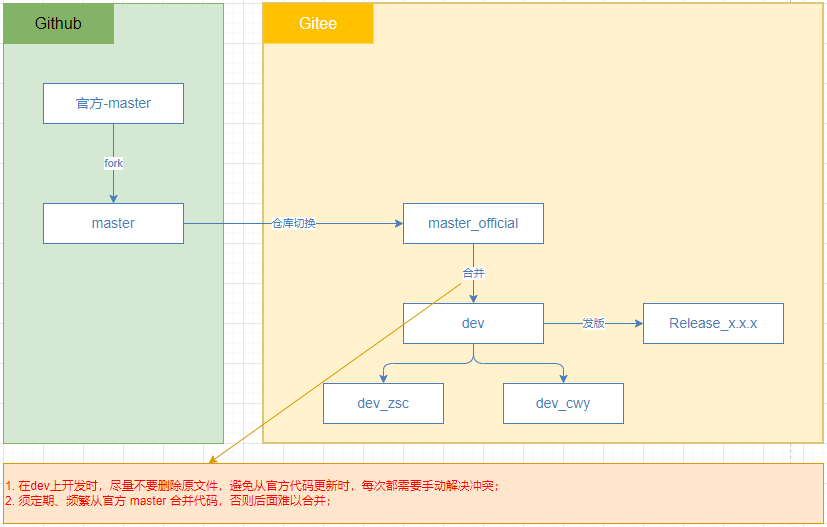

# NIP Front

## 代码分支

* Git 官方：https://github.com/ant-design/ant-design-pro
* Git fork：https://github.com/CYLJ126/ant-design-pro
* Gitee：https://gitee.com/cylj126/nobody-is-perfect-front



## 依赖

```bash
# 添加 KeepAlive 组件
yarn add react-activation

# 添加依赖，解决启动时 swagger ui 报 ModuleBuildError: ./node_modules/swagger-ui-dist/swagger-ui.css 的错
yarn add style-loader css-loader -D

# 国密
yarn add sm-crypto
yarn add -D @types/sm-crypto

# Tiptap 富文本
yarn add @rcode-link/tiptap-drawio @tiptap/core @tiptap/extension-character-count @tiptap/extension-code-block-lowlight @tiptap/extension-details @tiptap/extension-file-handler @tiptap/extension-highlight @tiptap/extension-image @tiptap/extension-list @tiptap/extension-mathematics @tiptap/extension-mention @tiptap/extension-placeholder @tiptap/extension-table @tiptap/extension-twitch @tiptap/extension-youtube @tiptap/markdown @tiptap/pm @tiptap/react @tiptap/starter-kit @tiptap/suggestion lowlight 
```

## 构建或启动

- 如果发现改了依赖或什么内容，没生效的，可以删除 `src/.umi` 目录 和 `node_modules/.cache` 目录，再 `yarn start` 启动；
